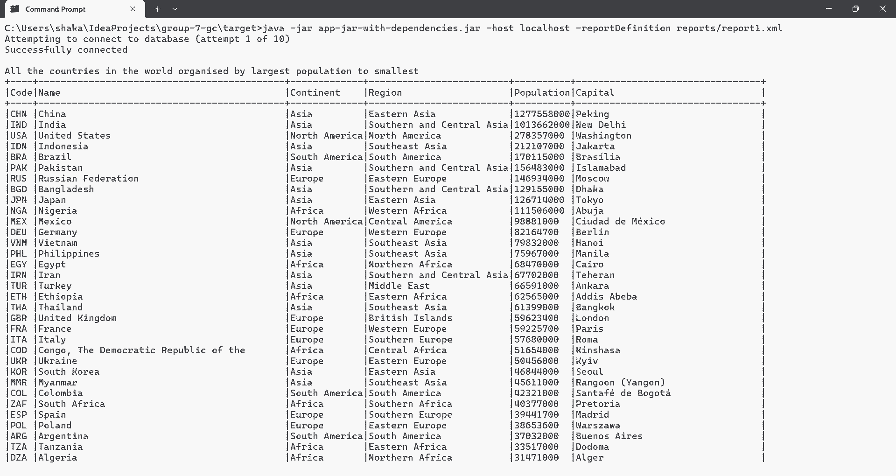
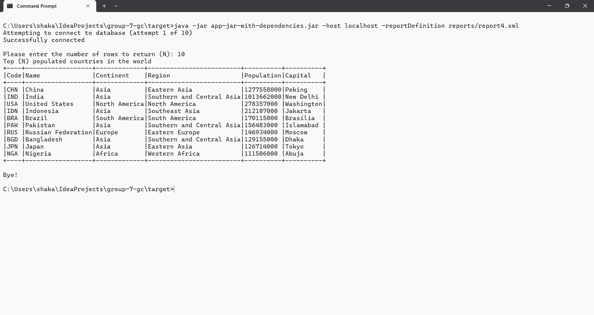
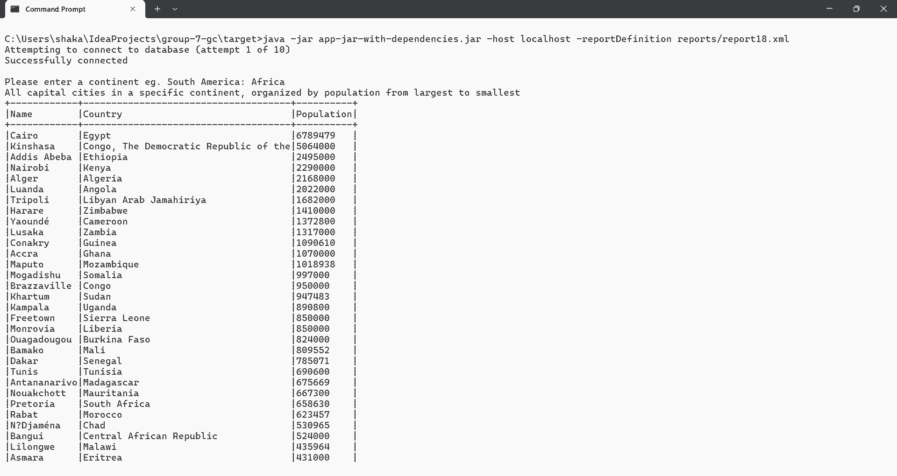

# Software Engineering Methods Coursework Assessment

Group project for the development of Java software, for a fictitious organisation, that reports on population information. 
The scrum team consists of the following persons:

- Ahnaf Faiz
- Kingsley Forbes
- Maria Fernandez
- Norberto Coye
- Shaka Dow
- Wellington Ramsey

### Requirements Implemented

32 requirements of 32 have been implemented, which is 100%

### Evidence of Requirements Implemented

| ID | Name                                                                                                 | Met | Screenshot                                      |
|----|------------------------------------------------------------------------------------------------------|-----|-------------------------------------------------|
| 1  | All the countries in the world organised by largest population to smallest                           | Yes |   |
| 2  | All the countries in a continent organised by largest population to smallest                         | Yes |   |
| 3  | All the countries in a region organised by largest population to smallest                            | Yes |   |
| 4  | The top N populated countries in the world where N is provided by the user                           | Yes |   |
| 5  | The top N populated countries in a continent where N is provided by the user                         | Yes |   |
| 6  | The top N populated countries in a region where N is provided by the user                            | Yes |   |
| 7  | All the cities in the world organised by largest population to smallest                              | Yes |   |
| 8  | All the cities in a continent organised by largest population to smallest                            | Yes |   |
| 9  | All the cities in a region organised by largest population to smallest                               | Yes |   |
| 10 | All the cities in a country organised by largest population to smallest                              | Yes |  |
| 11 | All the cities in a district organised by largest population to smallest                             | Yes |  |
| 12 | The top N populated cities in the world where N is provided by the user                              | Yes |  |
| 13 | The top N populated cities in a continent where N is provided by the user                            | Yes |  |
| 14 | The top N populated cities in a region where N is provided by the user                               | Yes |  |
| 15 | The top N populated cities in a country where N is provided by the user                              | Yes |  |
| 16 | The top N populated cities in a district where N is provided by the user                             | Yes |  |
| 17 | All the capital cities in the world organised by largest population to smallest                      | Yes |  |
| 18 | All the capital cities in a continent organised by largest population to smallest                    | Yes |  |
| 19 | All the capital cities in a region organised by largest to smallest                                  | Yes |  |
| 20 | The top N populated capital cities in the world where N is provided by the user                      | Yes |  |
| 21 | The top N populated capital cities in a continent where N is provided by the user                    | Yes |  |
| 22 | The top N populated capital cities in a region where N is provided by the user                       | Yes |  |
| 23 | The population of people, people living in cities, and people not living in cities in each continent | Yes |  |
| 24 | The population of people, people living in cities, and people not living in cities in each region    | Yes |  |
| 25 | The population of people, people living in cities, and people not living in cities in each country   | Yes |  |
| 26 | The population of the world                                                                          | Yes |  |
| 27 | The population of a continent                                                                        | Yes |  |
| 28 | The population of a region                                                                           | Yes |  |
| 29 | The population of a country                                                                          | Yes |  |
| 30 | The population of a district                                                                         | Yes |  |
| 31 | The population of a city                                                                             | Yes |  |
| 32 | number of people who speak Chinese, English, Hindi, Spanish, and Arabic                              | Yes |  |

## Running the Application in Non-Interactive Mode (default)

1. Type "docker-compose up" to build and launch the "app" and "db" containers. You will see the output for report documented in use-case-1.md
2. Hit Ctrl-C to return to the command prompt
3. Type "docker-compose down" to stop and remove the containers (i.e. to clean up)

## Running the Application in Interactive Mode

1. Uncomment the line in the application Dockerfile with the word "ENTRYPOINT"
2. To avoid having to edit code to communicate with localhost, type "echo 127.0.0.1 db >> %WINDIR%\System32\Drivers\Etc\Hosts" so that db resolves to localhost
3. Type "docker-compose up -d" to build and execute the containers in detached mode
4. Type "docker-compose exec app java -jar app-0.1.0.5-jar-with-dependencies.jar" to execute the Java application within the app container
5. Navigate to the report you would like to view using the menus
6. Once you have exited the application, type "docker-compose down" to stop and remove the containers

## Development Tips

To run the MySQL docker image on your local PC during development, do the following:

1. Enter the "db" subdirectory
2. To build the docker image type "docker build -t db ."
3. To create and run a container based on the image type "docker run  -d --rm -p 3306:3306 db"
4. At this point, you can use MySQL Workbench or DBeaver to connect to MySQL at localhost port 3306 using login "root" and password "group-7-gc"
5. If you plan on testing the application with the container you spawned in step 3 then temporarily set the DB_HOST variable in the App.java class to "localhost"

# Application Requirements

Software Requirements:
----------------------

- Software should permit non-interactive execution where user input is not required. This will be useful for automated testing
- Software should permit interactive execution where users can navigate through a hierarchy of menus to select the report they want to view
- Upon successful DB connection, user should be presented with a top-level menu (report groups)
- After making a top-level menu selection (or entering E to exit), the user should be presented with a list of reports for the group selected
- Once a report is selected, the user should be prompted for the required criteria (e.g. country) or P to return to the top-level menu
- Validation of the required input should be performed before the report is executed
- The report can be presented as a table with columns sized by scanning through the field names and all results returned
- If no results are returned, rather than a table, the output "No results found!" can be displayed to the user
- The user should be returned to the top-level menu after the report is executed (regardless of whether of not results were found)

### Screen Capture of Application Running in Interactive Mode:

    C:\Users\shaka\IdeaProjects\group-7-gc\target>java -jar app-jar-with-dependencies.jar -host localhost
    Attempting to connect to database (attempt 1 of 10)
    Successfully connected
    
    Main Menu
    1 - All the countries in the world organised by largest population to smallest
    2 - All the countries in a continent organised by largest population to smallest
    3 - All the countries in a region organised by largest population to smallest
    4 - The top N populated countries in the world where N is provided by the user
    5 - The top N populated countries in a continent where N is provided by the user
    6 - The top N populated countries in a region where N is provided by the user
    7 - All the cities in the world organised by largest population to smallest
    8 - All the cities in a continent organised by largest population to smallest
    9 - All the cities in a region organised by largest population to smallest
    10 - All the cities in a country organised by largest population to smallest
    11 - All the cities in a district organised by largest population to smallest
    12 - The top N populated cities in the world where N is provided by the user
    13 - The top N populated cities in a continent where N is provided by the user
    14 - The top N populated cities in a region where N is provided by the user
    15 - The top N populated cities in a country where N is provided by the user
    16 - The top N populated cities in a district where N is provided by the user
    17 - All the capital cities in the world organised by largest population to smallest
    18 - All the capital cities in a continent organised by largest population to smallest
    19 - All the capital cities in a region organised by largest to smallest
    20 - The top N populated capital cities in the world where N is provided by the user
    21 - The top N populated capital cities in a continent where N is provided by the user
    22 - The top N populated capital cities in a region where N is provided by the user
    23 - The population of people, people living in cities, and people not living in cities in each continent
    24 - The population of people, people living in cities, and people not living in cities in each region
    25 - The population of people, people living in cities, and people not living in cities in each country
    26 - The population of the world
    27 - The population of a continent
    28 - The population of a region
    29 - The population of a country
    30 - The population of a district
    31 - The population of a city
    32 - The number of people who speak Chinese, English, Hindi, Spanish, and Arabic
    E - Exit
    Please make a selection (1...32 or E): 2
    Please enter a continent eg. Europe: South America
    All the countries in a continent organised by largest population to smallest
    +----+----------------+-------------+-------------+----------+-----------------+
    |Code|Name            |Continent    |Region       |Population|Capital          |
    +----+----------------+-------------+-------------+----------+-----------------+
    |BRA |Brazil          |South America|South America|170115000 |Brasília         |
    |COL |Colombia        |South America|South America|42321000  |Santafé de Bogotá|
    |ARG |Argentina       |South America|South America|37032000  |Buenos Aires     |
    |PER |Peru            |South America|South America|25662000  |Lima             |
    |VEN |Venezuela       |South America|South America|24170000  |Caracas          |
    |CHL |Chile           |South America|South America|15211000  |Santiago de Chile|
    |ECU |Ecuador         |South America|South America|12646000  |Quito            |
    |BOL |Bolivia         |South America|South America|8329000   |La Paz           |
    |PRY |Paraguay        |South America|South America|5496000   |Asunción         |
    |URY |Uruguay         |South America|South America|3337000   |Montevideo       |
    |GUY |Guyana          |South America|South America|861000    |Georgetown       |
    |SUR |Suriname        |South America|South America|417000    |Paramaribo       |
    |GUF |French Guiana   |South America|South America|181000    |Cayenne          |
    |FLK |Falkland Islands|South America|South America|2000      |Stanley          |
    +----+----------------+-------------+-------------+----------+-----------------+